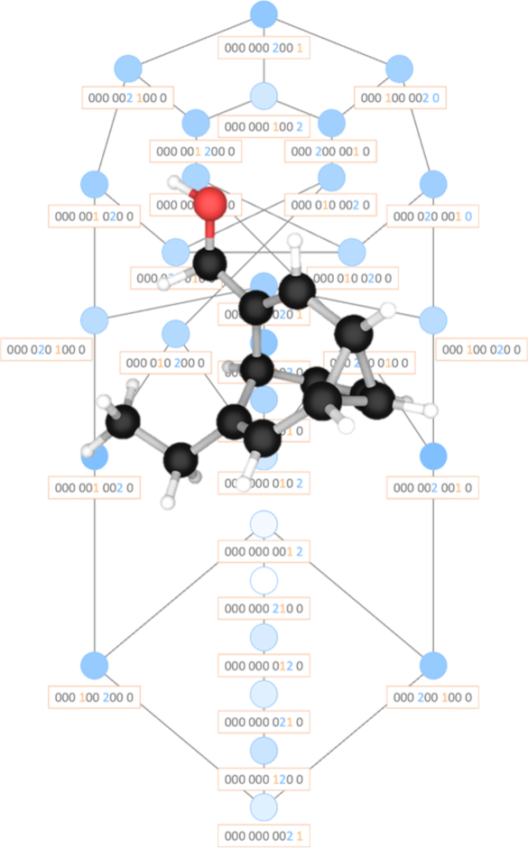

<table align="center">
<tr><td align="center" width="10000">

<p>
    
</p>

# <strong> B U L L V I S O </strong>

<p>
    <a href="https://linkedin.com/in/conorrankine" > Dr. Conor D. Rankine </a> + <a href="https://york.ac.uk/chemistry/people/pmcgonigal/" > Prof. Paul McGonigal </a> <br> @ <a href="https://york.ac.uk" >The University of York </a>
</p>

<p>
    <a href="https://mcgonigalgroup.com/" > The McGonigal Group </a>
    <br>
    with special thanks to
    <br>
    <a href="https://linkedin.com/in/mariia-kuznetsova-9870bb217/" > Maria Kuznetsova </a>
    <br>
    <a href="https://linkedin.com/in/robives5" > Rob Ives </a>
    <br>
    <a href="https://linkedin.com/in/will-maturi-930738196" > Will Maturi </a>
</p>

<p>
If you enjoy BULLVISO, don't forget to cite:
</p>

<p>
    <a href="https://doi.org/10.1039/D4SC03700F" > A Guide to Bullvalene Stereodynamics </a>
    <br>
    <i>Chem. Sci.</i>, 2024, <b>15</b>, 14608-14617 (DOI: 10.1039/D4SC03700F).
</p>

<p>
    <a href="https://doi.org/10.1039/D4SC03699A" > Correlated Shapeshifting and Configurational Isomerization </a>
    <br>
    <i>Chem. Sci.</i>, 2024, <b>15</b>, 14618-14624 (DOI: 10.1039/D4SC03699A).
</p>

</td></tr></table>

#

## ⚙️ SETUP

Our favourite way to use BULLVISO is with <a href="https://docs.astral.sh/uv/" > `uv` </a> from <a href="https://astral.sh/" > Astral</a>! It's super-easy to install from your terminal (if you don't have it already) with:

```
pip install uv
```

You can use `uv` to create and activate a virtual environment:

```
uv venv .venv
source .venv/bin/activate
```

and then install BULLVISO directly into your new virtual environment with:

```
uv pip install git+https://www.gitlab.com/conorrankine/bullviso
```

Don't forget to keep BULLVISO up to date; it's still under development, after all! It's easy to do with:

```
uv pip install --upgrade git+https://www.gitlab.com/conorrankine/bullviso
```

When you're done with BULLVISO, you can deactivate your virtual environment with:

```
deactivate
```

and reactivate it later with:

```
source .venv/bin/activate
```

Now you're good to go!

## 🦾 QUICKSTART

BULLVISO has one core command line script: `bullviso`.

### HOMOSUBSTITUTED BULLVALENES

#### MY FIRST BULLVALENES

You can use `bullviso` to generate the unique constitutional isomers of a monosubstituted bullvalene by passing the SMILES string of the substituent as a command line argument, *e.g.*,

```
bullviso "C"
```

generates the four unique constitutional isomers of methylbullvalene.

You can use the `-n [N_SUBS]` flag to generate di- , tri-, *etc.* substituted (*i.e* *n*-substituted) bullvalenes, *e.g.*,

```
bullviso "C" -n 3
```

generates the 42 unique constitutional isomers of trimethylbullvalene.

For larger substituents, you might also want to specify an alternative attachment point on the SMILES string of the substituent. BULLVISO attachs the substituent *via* the first atom in the SMILES string by default.

You can use the `-a [SUB_ATTACH_IDX]` flag to specify an alternative attachment point, *e.g.*,

```
bullviso "CCCC"
```

generates the four unique constitutional isomers of *n*-butylbullvalene, while

```
bullviso "CCCC" -a 2
```

generates the four unique constitutional isomers of 2-butylbullvalene.

#### CONTROLLING CONFORMER GENERATION

If you're working with large or floppy/flexible substituents, you might want to generate the conformational isomers of each unique constitutional isomer too. BULLVISO generates only the lowest-energy conformational isomer of each unique constitutional isomer by default.

You can use the `-m [M_CONFS]` flag to generate the *m* lowest-energy conformational isomers of each unique constitutional isomer instead, *e.g.*,

```
bullviso "CCCC" -n 2 -m 6
```

generates (up to a maximum of) the six lowest-energy conformational isomers of each of the 15 unique constitutional isomers of dibutylbullvalene.

The energy minimisation (or '*geometry optimisation*') can be carried out using either the Universal Forcefield (UFF) or Merck Molecular Forcefield (MMFF), and this can be toggled using the `-ff [FF_TYPE]` flag. BULLVISO uses UFF by default.

BULLVISO prunes similar conformational isomers by root-mean-square deviation (RMSD) thresholding; the default RMSD threshold is 0.5 Angstroem, although this can be set to an alternative (*e.g.* a tighter or looser) threshold using the `-rmsd [PRUNE_RMS_THRESH]` flag. Any conformational isomers that have an RMSD lower than the RMSD threshold when evaluated against any of the conformational isomers already generated are pruned (*i.e.* discarded).

The generation of the conformational isomers is the most time- and compute-intensive part of the BULLVISO workflow. Fortunately, you can accelerate the generation of the conformational isomers using multithreading. BULLVISO uses only one thread by default, although you can use the `-nt [NUM_THREADS]` flag to request additional threads (up to as many as your machine supports!) for faster conformational isomer generation.

### HETEROSUBSTITUTED BULLVALENES

You can generate heterosubstituted bullvalenes (*i.e.* bullvalenes with more than one kind of substituent) by passing the SMILES strings of multiple different substituents as separate command line arguments, *e.g.*,

```
bullviso "C" "CC" "CCC"
```

generates the 240 unique constitutional isomers of (methyl,ethyl,*n*-propyl)bullvalene.

BULLVISO recognises when you pass the SMILES strings of equivalent substituents in this way and specify a homosubstituted bullvalene using the syntax for a heterosubstituted bullvalene, *e.g.*,

```
bullviso "C" "C"
```

is equivalent to

```
bullviso "C" -n 2
```

and both generate the 15 unique constitutional isomers of dimethylbullvalene.

You can use `-n [N_SUBS]` and `-a [SUB_ATTACH_IDX]` flags to modify the number of substituents and/or the attachment points on the SMILES strings of the substituents by passing lists of values as command line arguments where each element of the list corresponds to each of the SMILES strings defining the substituents, *e.g.*,

```
bullviso "C" "CC" "CCC" -n [2,2,1]
```

generates the 2520 unique constitutional isomers of (dimethyl,diethyl,*n*-propyl)bullvalene, while

```
bullviso "C" "CC" "CCC" -n [2,2,1] -a [1,1,2]
```

generates the 2520 unique constitutional isomers of (dimethyl,diethyl,isopropyl)bullvalene.

### BRIDGING SUBSTITUENTS

#### DOUBLY-BRIDGING SUBSTITUENTS

It's also possible to use the `-a [SUB_ATTACH_IDX]` flag to specify multiple attachment points on the same substituent and create a '*bridging*', or '*bifunctional*', group *e.g.*,

```
bullviso "CC(N)=O" -a [[1,3]]
```

generates the 30 unique constitutional isomers of (lactam)bullvalene. BULLVISO won't output all 30 in this case, though - some of these unique constitutional isomers are mechanically impossible (*e.g.* isomers where the lactam bridges between the $\alpha$ and $\delta$ positions of the bullvalene).

Note the double set of square brackets around the argument passed with the `-a [SUB_ATTACH_IDX]` flag (`[[1,3]]`) that turn it into a nested (sub)list: this is to specify that the first substituent (acetamide; SMILES = "CC(N)=O"), is attached to the bullvalene at the atomic indices 1 and 3. A single set of square brackets around the argument passed with the `-a [SUB_ATTACH_IDX]` flag (`[1,3]`) would specify a first substituent attached at atomic index 1 and a second substituent attached at atomic index 3 with reference to their respective SMILES strings; BULLVISO would throw an error here as only a single SMILES string is specified.

You can generate substituted bullvalenes with both singly- and doubly-attached substituents using the same syntax, *e.g.*,

```
bullviso "C" "CC(N)=O" -n [2,1] -a [1,[1,3]]
```

generates the 840 unique constitutional isomers of (dimethyl,lactam)bullvalene.

#### MULTIPLY-BRIDGING/MULTIPLEXING SUBSTITUENTS

As long as the total number of attachment points remains below nine, there are no limits as to how many attachment points can be specified for a single substituent, allowing you to create '*multiply-bridging*', '*multiplexed*', or '*polyfunctional*' groups - as long as your ideas are mechanically sound!

#### SYMMETRIC VS. ASYMMETRIC BRIDGING SUBSTITUENTS

BULLVISO considers each attachment point on a single substituent as unique, *i.e.*, for a substituted bullvalene with a single substituent attached at two points, like (lactam)bullvalene, the [0000000012] and [0000000021] constitutional isomers are considered inequivalent.

This is fine for (lactam)bullvalene since the [1] and [2] bits in the bullvalene isomer barcode correspond to the inequivalent attachment points at the atomic indices 1 (C) and 3 (N), respectively, on the substituent (acetamide; SMILES = "CC(N)=O"). For symmetric substituents attached at two (or more) points, however, this assumption is *not* necessarily valid, *e.g.*,

```
bullviso "CSSC" -a [[1,4]]
```

generates 30 constitutional isomers for (disulfide)bullvalene, but only 15 of these are unique since the [1] and [2] bits in the bullvalene isomer barcode are interchangable (accounting for the symmetry of the substituent): *e.g.*, the structures of the [0000000012] and [0000000021] constitutional isomers are identical.

### OUTPUT OPTIONS

BULLVISO organises the outputted structures of the substituted bullvalenes into separate directories labelled using the bullvalene isomer barcode and, inside these, into (sub)directories labelled using the bullvalene isomer barcode and conformational isomer number. By default, these output directories are created in the present working directory (PWD) where `bullviso` is called, although you can use the `-o [OUTPUT_DIR]` flag to create the output directory heirarchy somewhere else on your system by providing an alternative path. If the output directory doesn't exist, BULLVISO will try to create it.

BULLVISO outputs the structures of the substituted bullvalenes in .xyz format by default, although you can use the `-f [OUTPUT_FILETYPE]` flag to output in an alternative format, *e.g.* .sdf/.mol (`-f sdf`), or a basic (customisable) input file for <a href="https://gaussian.com/gaussian16/" > Gaussian </a> (`-f gaussian`) or <a href="https://kofo.mpg.de/en/research/services/orca" > Orca </a> (`-f orca`).

### HELP

Don't forget that you can always get a reminder of, and help with, the available command line flags by entering:

```
bullviso -h
```

## 🗒️ LICENSE

BULLVISO is free software: you can redistribute it and/or modify it under the terms of the Lesser GNU General Public License (GPL) as published by the Free Software Foundation, either Version 3 of the license (GPLv3), or (at your option) any later version.

BULLVISO is distributed in the hope that it will be useful, but without any warranty; without even the implied warranty of merchantability or fitness for a particular purpose. See the Lesser GNU GPL for more details.

Unless you explicitly state otherwise, any contribution you intentionally submit for inclusion in BULLVISO is licensed as in the Lesser GNU GPL without any additional terms or conditions.
